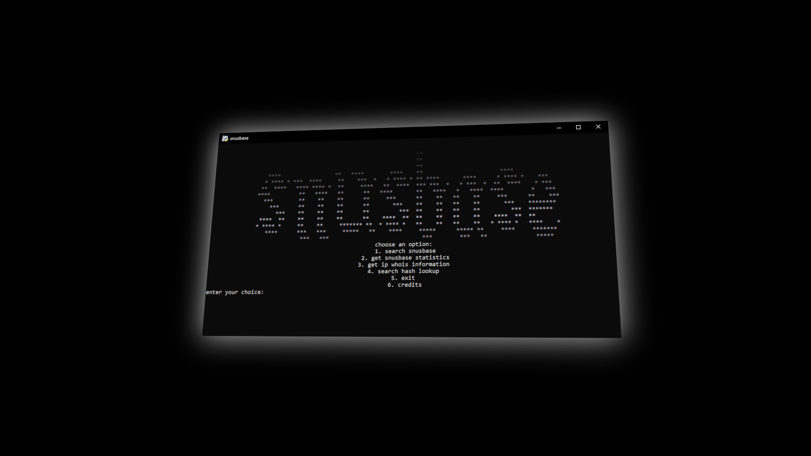

# snusbase api wrapper

<strong>custom-built cli interface for the <a href="https://snusbase.com">Snusbase API</a>.</strong>  
<strong>requires a snusbase api key.</strong>

## Installation

1. <strong>clone the repository</strong>:
   ```bash
   git clone https://github.com/wrendw/snusbase-api-wrapper.git
   ```
2. <strong>install correct library's</strong>:
   ```python
   pip install requests
   ```
   ```python
   pip install pystyle
   ```

3. <strong>input your api key</strong>:
   ```python
   snusbase_auth = 'YOUR-KEY'
   ```

4. <strong>done</strong>



made by <strong>wren</strong> in just 20 minutes.
discord: <strong>@spyism</strong>
website: <strong><a href="https://wren.lol/">wren.lol</a></strong>
